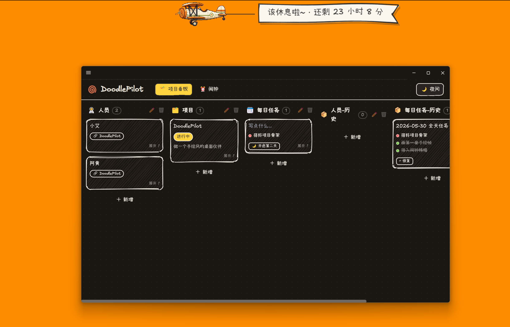

<div align="center">
  

  <h3>你的手绘风桌面「办公搭子」。</h3>
  <p>一块温暖的涂鸦风项目看板 —— 外加会拉着横幅飞过屏幕的小纸飞机闹钟。</p>

  <p>
    <a href="./LICENSE"></a>
    
    
    
  </p>

  <h4>
    <a href="./README.md">English</a> &nbsp;|&nbsp; 简体中文
  </h4>
</div>

<br />

<div align="center">
  
</div>

<br />

DoodlePilot 是一个小小的桌面应用，想让「安排今天要做的事」少一点办公软件的冰冷，多一点在本子角落涂鸦的轻松。这里的一切都是手绘的 —— Rough.js 抖动的线条、Excalifont 手写字体、温暖的纸张网格 —— 而且每一处摸上去都软软的、Q 弹的。

## 功能特性

- 🎨&nbsp;&nbsp;**处处手绘** —— Rough.js 手绘线框、Excalifont 字体、暖色纸张网格画布。
- 🗂️&nbsp;&nbsp;**飞书 / Lark 风格看板** —— 可完全自定义、调宽、拖动排序的竖列与卡片。
- 🧩&nbsp;&nbsp;**丰富的属性类型** —— 文本、数字（按住上下拖动调节！）、状态、任务清单、单选 / 多选标签、日期（手绘日历）、日期区间、勾选、链接、关联、人员。
- ✅&nbsp;&nbsp;**每日任务** —— 一天一张卡；每条任务可选 待办 / 进行中 / 已完成；点「**开启第二天**」会把这一天整体归档，并把没做完的任务自动带到新的一天。
- ⏰&nbsp;&nbsp;**纸飞机闹钟** —— 到点时，一架小飞机会拉着你的提醒横幅飞过桌面。
- ⏳&nbsp;&nbsp;**提前与重复提醒** —— 提前 _X_ 分钟提醒，每 _X_ 分钟飞一次。
- 🧈&nbsp;&nbsp;**Q 弹动效** —— 弹簧般的拖动排序，以及「抓住空白处拖动」的惯性滚动，边缘还有橡皮筋回弹。
- 🗃️&nbsp;&nbsp;**归档与恢复** —— 每个竖列都有自己的「-历史」列，一键把卡片放回去。
- 🌓&nbsp;&nbsp;**白天 / 夜间**纸张主题。
- 🔒&nbsp;&nbsp;**本地优先** —— 数据保存在本地的单个 SQLite 文件里，不会离开你的电脑。
- 🖥️&nbsp;&nbsp;**跨平台** —— Windows、macOS、Linux（基于 Electron）。
- ⚒️&nbsp;&nbsp;**可扩展内核** —— 带类型的 query / command / event / hook 契约，助手或脚本也能驱动看板。

## 我为什么要做 DoodlePilot？

我想要一个**办公搭子** —— 我心目中那种待在桌面上的小伙伴，让「把事情理清楚」变得温暖又好玩，而不是公事公办。大多数任务工具都是灰色的格子和死板的表单；而我想要的，是像在笔记本边角涂鸦那样的东西——戳一下它会弹一弹，提醒我的时候是一架小飞机，而不是冷冰冰的系统通知。

于是我就先为自己做了它。**这是一个个人项目**，现在这一版我自己用着挺顺手了，之后只要有空，我就会一点点继续打磨它，把我心目中「办公搭子」该有的功能慢慢补上。

如果你有任何想法、心愿，或者发现了 bug —— **欢迎在 [issues](../../issues) 里告诉我！** 我真的很想听听，你希望自己的桌面搭子是什么样子的。💛

## 开始使用

DoodlePilot 基于 Electron + Vite + React 构建。

```bash
# 安装依赖
npm install

# 开发模式运行（热更新）
npm run dev

# 类型检查 + 生产构建
npm run build

# 为你的系统打包安装程序
npm run build:win     # Windows
npm run build:mac     # macOS
npm run build:linux   # Linux
```

数据保存在系统的应用数据目录里：

- **Windows** —— `%APPDATA%\DoodlePilot\doodlepilot.sqlite`
- **macOS** —— `~/Library/Application Support/DoodlePilot/`
- **Linux** —— `~/.config/DoodlePilot/`

## 技术栈

Electron · electron-vite · React 19 · Zustand · Tailwind CSS · framer-motion · PixiJS · Rough.js · sql.js · TypeScript。

## 状态与计划

这一版**已经固定下来啦** 🎉 —— 但这只是开始，不是结束。我会把它当作业余爱好，有空的晚上就加点新东西：更多属性类型、更聪明的每日 / 每周流程，以及更多让人会心一笑的小动画。

## 参与 / 想法

这是一个人的业余项目，但非常欢迎你的点子 —— 在 [issues](../../issues) 里提功能建议、贴草图，或者告诉我哪里怪怪的。✏️

## 许可证

DoodlePilot 基于 [GNU GPLv3](./LICENSE) 开源。

任何修改版或衍生版 —— 无论是以**分发**还是**网络服务**的形式提供 —— 都必须：

- 继续以 **GPLv3 / AGPLv3** 许可，
- **保留原始版权声明**,
- **明确标注所做的修改**。
